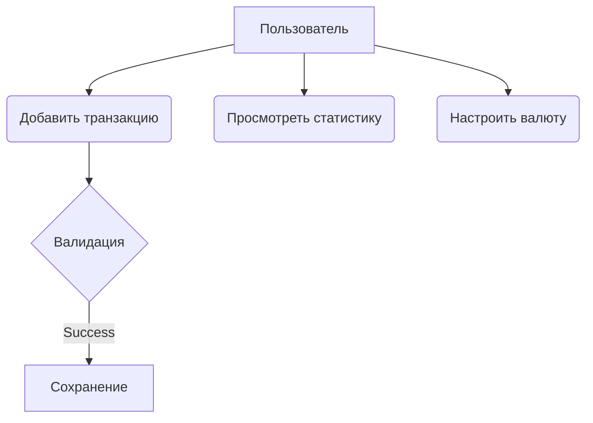
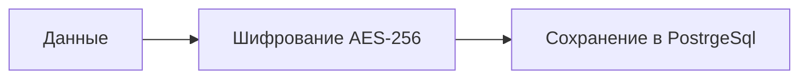

# Персональный менеджер учёта расходов

---

## 🏠 Главная страница

Мобильное приложение для учета личных финансов с функциями:
- Внесение доходов/расходов с категоризацией
- Автоматическая конвертация валют в USD
- Визуальная аналитика (графики и диаграммы)

**Быстрые ссылки**:
- [Функциональные требования](#🔧-функциональные-требования)
- [Диаграмма файлов](#📁-диаграмма-файлов-приложения)
- [Спецификация](#⚙️-дополнительная-спецификация)

---

## 🔧 Функциональные требования

### Основные функции
1. **Добавление транзакций**:
   - Выбор типа (доход/расход)
   - Ввод суммы с выбором валюты (USD, BYN, USDT)
   - Указание категории и описания

2. **Конвертация валют**:
   ```mermaid
   flowchart LR
     A[BYN] -->|Курс ЦБ| B(USD)
     C[USDT] -->|Курс биржи| B
   ```

3. **Статистика**:
   - Круговые диаграммы по категориям
     

   - Линейные графики за выбранный период

### Use Case диаграмма


### Сценарий использования
```gherkin
Сценарий: Добавление расхода
  Дано Я на главном экране приложения
  Когда Я нажимаю "+"
  И Выбираю "Расход"
  И Ввожу сумму 3500 BYN
  И Указываю категорию "Техника"
  Тогда Транзакция сохраняется
  И Баланс уменьшается на $1000 (по курсу)
```

---

## 📁 Диаграмма файлов приложения

```plaintext
pmvs12a-lab8-smalldata/
├── app/
│   ├── src/
│   │   ├── main/
│   │   │   ├── java/com/example/expensemanager/
│   │   │   │   ├── di/                # Dependency Injection (Koin/Dagger)
│   │   │   │   ├── model/
│   │   │   │   │   ├── Transaction.kt # Data class
│   │   │   │   │   └── Currency.kt    
│   │   │   │   ├── repository/
│   │   │   │   │   ├── CurrencyRepository.kt # API для курсов валют
│   │   │   │   │   └── TransactionRepository.kt 
│   │   │   │   ├── ui/
│   │   │   │   │   ├── MainActivity.kt
│   │   │   │   │   ├── adapters/
│   │   │   │   │   │   └── TransactionAdapter.kt 
│   │   │   │   │   ├── viewmodels/
│   │   │   │   │   │   └── MainViewModel.kt 
│   │   │   │   │   └── fragments/
│   │   │   │   │       ├── AddTransactionFragment.kt
│   │   │   │   │       └── StatsFragment.kt
│   │   │   │   ├── utils/
│   │   │   │   │   └── CurrencyConverter.kt # Логика конвертации
│   │   │   ├── res/
│   │   │   │   ├── layout/
│   │   │   │   │   ├── activity_main.xml
│   │   │   │   │   └── fragment_add_transaction.xml
│   │   │   │   ├── values/
│   │   │   │   │   ├── strings.xml
│   │   │   │   │   └── colors.xml
│   │   │   │   └── drawable/
│   │   │   └── AndroidManifest.xml
│   │   ├── test/      # Unit тесты
│   │   └── androidTest/ # Интеграционные тесты
│   └── build.gradle   # Конфигурация модуля
├── build.gradle       # Корневой конфигурационный файл
└── settings.gradle    # Настройки проекта
```

---

## Диаграммы
### Диаграмма классов

### Диаграмма последвательности


## ⚙️ Дополнительная спецификация

### Ограничения
- Поддерживаемые валюты: USD, BYN, USDT
- Макс. сумма: $1,000,000 за операцию

### Требования безопасности


### Надежность
- Автосохранение каждые 60 секунд
- Резервное копирование в облако

### Диаграмма БД


---

[⬆️ К началу](#🏠-главная-страница)
```


