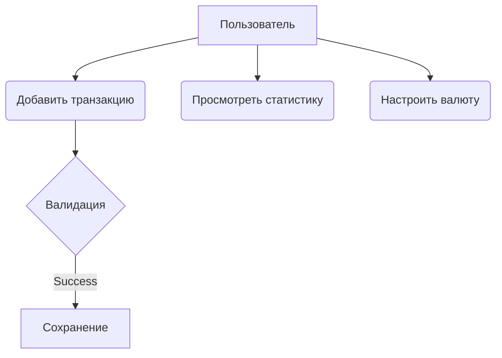
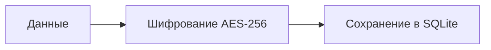

Вот единый файл `docs/index.md` для GitHub Pages:

```markdown
# Персональный менеджер учёта расходов

---

## 🏠 Главная страница

Мобильное приложение для учета личных финансов с функциями:
- Внесение доходов/расходов с категоризацией
- Автоматическая конвертация валют в USD
- Визуальная аналитика (графики и диаграммы)

**Быстрые ссылки**:
- [Функциональные требования](#🔧-функциональные-требования)
- [Диаграмма файлов](#📁-диаграмма-файлов-приложения)
- [Спецификация](#⚙️-дополнительная-спецификация)

---

## 🔧 Функциональные требования

### Основные функции
1. **Добавление транзакций**:
   - Выбор типа (доход/расход)
   - Ввод суммы с выбором валюты (USD, BYN, USDT)
   - Указание категории и описания

2. **Конвертация валют**:
   ```mermaid
   flowchart LR
     A[BYN] -->|Курс ЦБ| B(USD)
     C[USDT] -->|Курс биржи| B
   ```

3. **Статистика**:
   - Круговые диаграммы по категориям
   - Линейные графики за выбранный период

### Use Case диаграмма


### Сценарий использования
```gherkin
Сценарий: Добавление расхода
  Дано Я на главном экране приложения
  Когда Я нажимаю "+"
  И Выбираю "Расход"
  И Ввожу сумму 3500 BYN
  И Указываю категорию "Техника"
  Тогда Транзакция сохраняется
  И Баланс уменьшается на $1000 (по курсу)
```

---

## 📁 Диаграмма файлов приложения

```plaintext
pmvs12a-lab8-smalldata/
├── lib/
│   ├── models/
│   │   ├── transaction.dart  # Модель данных
│   │   └── currency.dart    # Валютные курсы
│   ├── views/
│   │   ├── home.dart        # Главный экран
│   │   └── stats.dart       # Статистика
│   └── services/
│       ├── db.dart          # Работа с БД
│       └── converter.dart   # Конвертер валют
├── test/                    # Тесты
└── pubspec.yaml             # Конфигурация
```

---

## ⚙️ Дополнительная спецификация

### Ограничения
- Поддерживаемые валюты: USD, BYN, USDT
- Макс. сумма: $1,000,000 за операцию

### Требования безопасности


### Надежность
- Автосохранение каждые 60 секунд
- Резервное копирование в облако

### Диаграмма БД
> [Здесь будет ER-диаграмма]

---

[⬆️ К началу](#🏠-главная-страница)
```

**Как использовать**:
1. Создайте папку `docs` в корне репозитория
2. Сохраните этот файл как `docs/index.md`
3. Включите GitHub Pages в настройках репозитория:
   - **Settings → Pages → Source: main branch /docs folder**

**Результат**:  
Сайт будет доступен по адресу:  
`https://fpmi-pmvs2025.github.io/pmvs12a-lab8-smalldata/`
